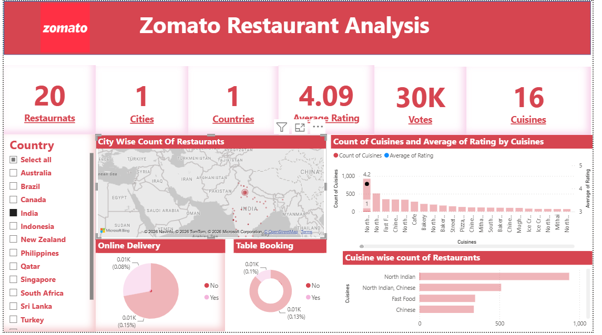

# Zomato Restaurant Analysis Dashboard

A Power BI dashboard for exploring restaurant distribution, ratings, cuisine categories, and service availability across countries and cities.

## Dashboard Preview



## Project Overview

This project presents restaurant data in an interactive, single-page Power BI report. It brings key metrics and visual comparisons into one place to support quick exploration of the dataset.

The dashboard focuses on:
- Restaurant distribution across countries and cities
- Restaurant ratings
- Cuisine categories and distribution
- Online delivery availability
- Table-booking availability

## Key Metrics

The current dashboard highlights the following top-level metrics:

| Metric | Value |
|---|---:|
| Restaurants | 899 |
| Cities | 98 |
| Countries | 14 |
| Average Rating | 4.05 |

*Metrics are reproduced from the dashboard and describe the dataset represented in this report.*

## What the Dashboard Covers

### Restaurant Distribution
Explore how restaurants are distributed across the countries and cities represented in the dataset.

### Cuisine Analysis
Review cuisine categories and compare their presence across the restaurant data.

### Ratings
Examine the rating overview shown in the report and explore the distribution of restaurants by rating.

### Service Availability
Compare the availability of online delivery and table booking across the restaurants in the dataset.

### Interactive Exploration
Use the dashboard's available filters to look at the data from different perspectives.

## Tools & Skills

- **Microsoft Power BI** — report and dashboard development
- **Data visualization** — presenting metrics and category comparisons
- **KPI reporting** — summarizing key dataset measures
- **Business intelligence** — organizing data for interactive exploration

## Repository Contents

```text
zomato-restaurant-analysis/
├── README.md
└── screenshots/
    └── image.png
```

The repository currently contains screenshots of the Power BI dashboard. The original `.pbix` report can be added separately if it is suitable for public sharing.

## Learnings

This project provided practice in structuring a single-page report around key metrics, selecting visualizations for categorical and geographic comparisons, and making restaurant data easier to explore through filters and dashboard interactions.

## Author

**Parth Jain**  
B.Sc. Information Technology | Aspiring Data Analyst / Business Analyst

- GitHub: [btwitssparth](https://github.com/btwitssparth)
- Portfolio: [parth-dev-lac.vercel.app](https://parth-dev-lac.vercel.app/)

---

*Portfolio project created for learning and demonstration purposes.*
